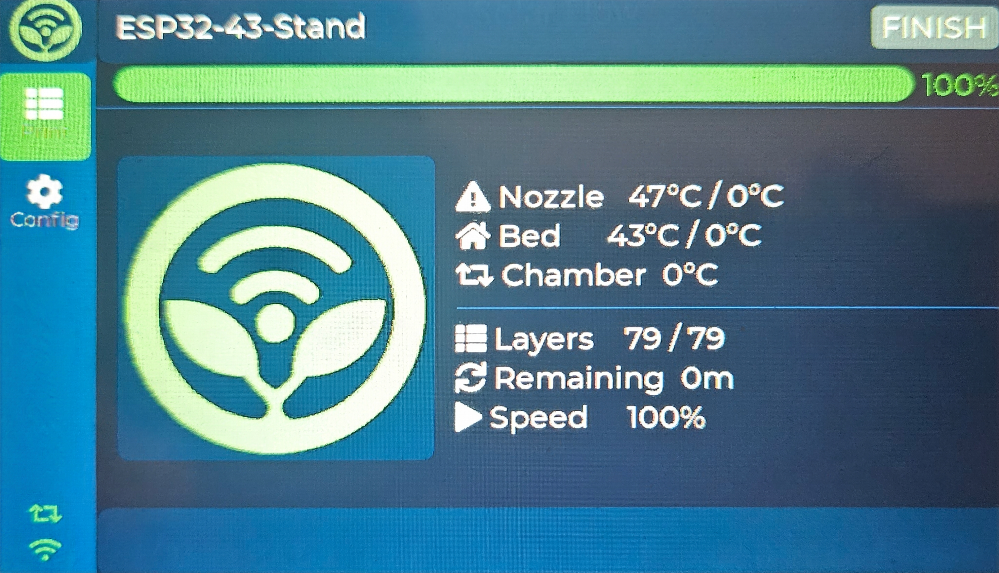

#   BambuTagger-Console

Multi-printer touchscreen dashboard for Bambu Lab printers. Runs on the Sunton ESP32-8048S043 (ESP32-S3, 800×480 RGB display) with real-time MQTT status, print thumbnails, and a web-based configuration portal.

[](https://ko-fi.com/G8M220JASY)

<p align="center">

</p>

---

## Features

| Category | Details |
|----------|---------|
| **Multi-printer** | Up to 4 printers on one screen; grid overview + full-screen detail per printer |
| **Live MQTT** | Connects directly to each printer on LAN (no cloud); nozzle / bed / chamber temps, progress, layers, remaining time, speed |
| **Thumbnails** | Downloads print thumbnail via FTPS and displays it on both grid cards and detail views |
| **Web portal** | Full printer and WiFi configuration via browser at the device IP; supports multiple printers |
| **OTA updates** | One-click firmware update from GitHub Releases with on-screen progress |
| **Persistent config** | All settings stored in ESP32 NVS, survives reboots, backward-compatible migration from single-printer format |
| **Dark UI** | Clean dark theme with green Bambu-style accents, sidebar navigation, capacitive touch |

---

## Hardware

### Bill of Materials

| Component | Notes | Buy |
|-----------|-------|-----|
| **Sunton ESP32-8048S043** | ESP32-S3, 800×480 RGB, GT911 touch | https://www.aliexpress.com/item/1005006032801470.html |

### Specifications

| Component | Details |
|-----------|---------|
| MCU | ESP32-S3 (240 MHz, dual-core) |
| Display | 800 × 480 RGB (16-bit), ~60 fps |
| Touch | GT911 (capacitive, I²C) |
| PSRAM | 8 MB OPI (used for frame buffers + thumbnail decode) |
| Flash | 16 MB |

---

## Software

### Required Libraries (PlatformIO)

| Library | Version | Purpose |
|---------|---------|---------|
| `LovyanGFX` | ^1.1.16 | Display driver + image decode |
| `LVGL` | ^8.3.11 | UI framework |
| `PubSubClient` | ^2.8 | MQTT client |
| `ArduinoJson` | ^7.0.4 | JSON parsing |
| `mbedTLS` | Built-in | TLS for MQTT + FTPS |

### Building

```bash
# Install PlatformIO (if not already)
pip install platformio

# Build
pio run -e esp32-8048s043

# Flash
pio run -e esp32-8048s043 -t upload

# Monitor
pio device monitor -b 115200
```

### Board Settings (platformio.ini)

| Setting | Value |
|---------|-------|
| Board | `esp32-s3-devkitc-1` |
| Flash Size | 16 MB |
| PSRAM | OPI (Octal) |
| Partition Scheme | Default 16MB with spiffs |

---

## Web Interface

Open a browser to the device IP (shown on the sidebar after WiFi connects). In AP mode the IP is `192.168.4.1`.

| Page | Description |
|------|-------------|
| **Config** | Printer configuration: number of printers (1–4), IP, serial number, access code per printer |
| **WiFi** | WiFi SSID and password |
| **Debug** | Raw HTML endpoint for troubleshooting |

The web portal saves to NVS and reboots the device. After reboot the browser auto-redirects to the config page.

---

## UI Layout

### Overview (2+ printers)

```
┌──────────────────────────────────────────────────────┐
│ ┌──────────────────┐ ┌──────────────────┐            │
│ │ Printer 1        │ │ Printer 2        │            │
│ │ [THUMB] JOB NAME │ │ [THUMB] JOB NAME │            │
│ │        220°C     │ │        215°C     │            │
│ │         55°C     │ │         50°C     │            │
│ │         32°C     │ │         30°C     │            │
│ │ ████████░░ 72%   │ │ ██████░░░░ 55%   │            │
│ │         🔄 1h20m │ │        🔄 0h45m │            │
│ └──────────────────┘ └──────────────────┘            │
├──────────────────────────────────────────────────────┤
│ [B] [📋] [⚙] [WiFi]              STATUS:  RUNNING   │
└──────────────────────────────────────────────────────┘
```

### Detail (single printer / tap card)

```
┌─────────────────────────────────────────────────────────┐
│ [BACK]  Printer 1                      [RUNNING]        │
│ ┌────────┐   🌡 Nozzle   220°C / 220°C                  │
│ │        │   🏠 Bed       55°C /  55°C                 │
│ │ THUMB  │   🔄 Chamber   32°C                         │
│ │        │                                             │
│ └────────┘   📋 Layers   72 / 100                      │
│              🔄 Remaining  0h 43m                      │
│              ▶ Speed     100%                          │
│ ████████████████░░░░░░░░░░░░░░░░░░  72%                 │
└─────────────────────────────────────────────────────────┘
```

---

## Printer Connection

| Parameter | Value |
|-----------|-------|
| Protocol | MQTT over TLS |
| Port | 8883 |
| Username | `bblp` (fixed) |
| Password | Printer Access Code |
| Subscribe | `device/<SERIAL>/report` |
| Publish | `device/<SERIAL>/request` |
| Thumbnail | FTPS (implicit TLS, port 990) at `/cache/` |

> TLS certificate verification is skipped — Bambu uses a self-signed certificate. All communication stays on your local network.

---

## Configuration Defaults

| Setting | Default |
|---------|---------|
| WiFi SSID | (empty, uses `DEFAULT_WIFI_SSID` in config.h) |
| WiFi Password | (empty, uses `DEFAULT_WIFI_PASSWORD` in config.h) |
| Printer IP | 192.168.1.100 |
| Printer Serial | (empty, uses `DEFAULT_BAMBU_SERIAL` in config.h) |
| Access Code | (empty, uses `DEFAULT_BAMBU_CODE` in config.h) |
| Max Printers | 4 |
| MQTT TLS | Yes (port 8883, no cert verify) |

---

## OTA Updates

- **Trigger**: Web portal save/update causes a reboot; after boot the browser auto-redirects
- **Overlay**: Full-screen progress with status text and progress bar during flashing
- **Endpoint**: Standard Arduino OTA via web upload
- Device auto-reboots after successful flash

---

## Project Structure

```
BambuTagger-Console/
├── platformio.ini                # Build config
├── include/
│   └── lv_conf.h                 # LVGL 8.3 configuration
└── src/
    ├── config.h                  # Default credentials + constants
    ├── main.cpp                  # Entry point, FreeRTOS tasks (Core 0/1)
    ├── display/
    │   └── display_driver.h      # LovyanGFX + LVGL bridge
    ├── bambu/
    │   ├── bambu_client.h/.cpp   # MQTT status client
    │   ├── ftps_client.h/.cpp    # Thumbnail downloader (FTPS)
    │   └── bambu_tls_client.h/.cpp  # Low-level TLS helper
    └── ui/
        ├── ui_manager.h/.cpp     # Sidebar + screen switcher
        ├── screen_overview.h/.cpp    # Printer grid overview
        ├── screen_status.h/.cpp      # Printer detail screen
        ├── screen_config_wifi.h/.cpp # WiFi config
        └── screen_config_printer.h/.cpp  # Printer config
```

---

## Troubleshooting

| Symptom | Fix |
|---------|-----|
| Display stays black | Check backlight pin (GPIO 2) and PSRAM allocation |
| Touch not responding | GT911 I²C address may be `0x14` instead of `0x5D` — change in `display_driver.h` |
| MQTT won't connect | Verify printer IP, serial, and access code; ensure printer is on same LAN |
| Thumbnail missing | Some firmware versions serve different paths; check serial monitor logs |
| PSRAM alloc fails | Ensure `board_build.psram_type = opi` and `board_build.arduino.memory_type = qio_opi` in platformio.ini |

---

## Credits & References

- [Bambu-Research-Group/RFID-Tag-Guide](https://github.com/Bambu-Research-Group/RFID-Tag-Guide)
- Display library: [LovyanGFX](https://github.com/lovyan03/LovyanGFX)
- UI framework: [LVGL](https://lvgl.io/)
- MQTT client: [PubSubClient](https://github.com/knolleary/pubsubclient)

---

## License

MIT — free to use, modify, and share.
